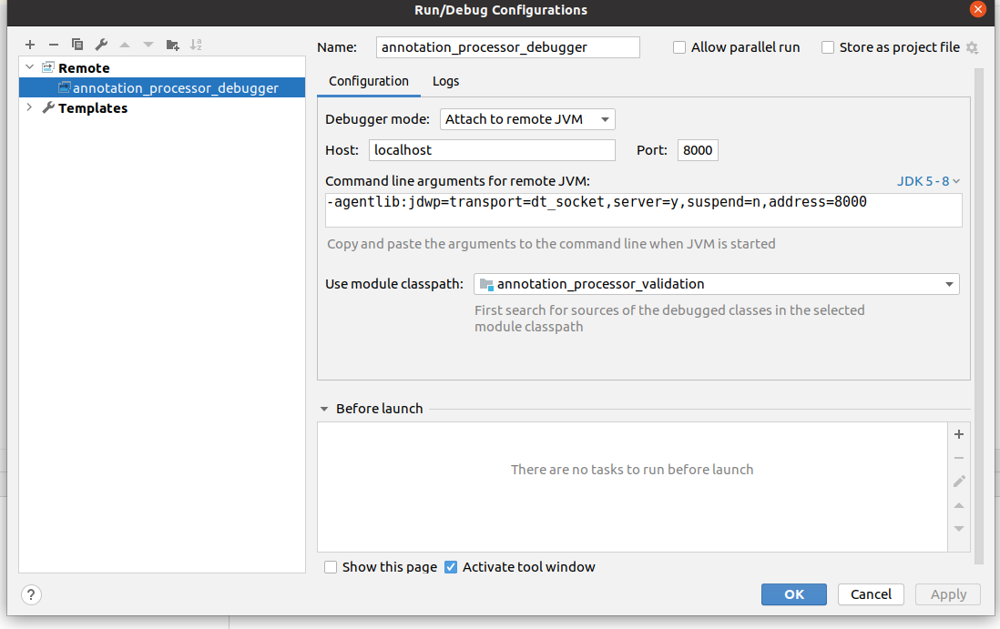
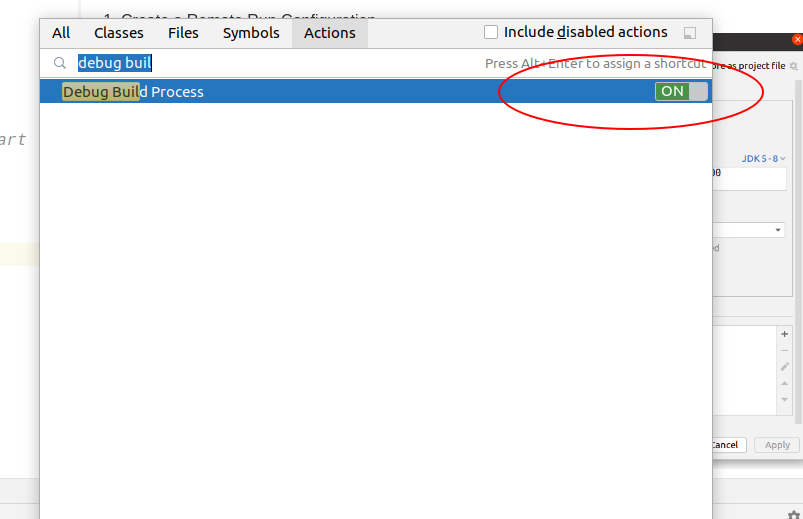
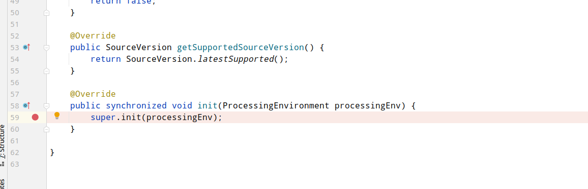
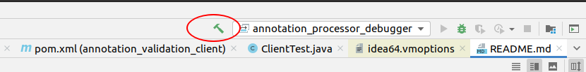
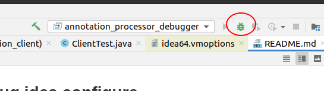
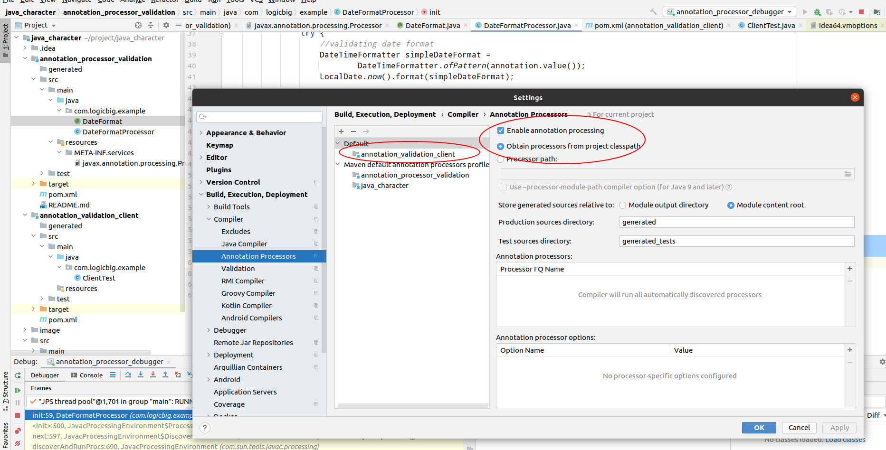

## annotation processor debug  idea configure 

1. Create a Remote Run Configuration


2. Make sure the build process uses your port
 
```
Invoke Ctrl+Shift+A > Edit Custom VM Options…
Now add `-Dcompiler.process.debug.port=8000`, save, and restart IDEA.
```

3. Enable “Debug build process”

You’ll need to repeat this step every time you restart IDEA.

4.Try it out 

First, set a break point in your annotation processor’s code (the method overriding AbstractProcessor#init is an excellent choice).



Next, compile some code that will trigger your annotation processor.



The build process will pause, allowing you to attach the debugger:

Now start the Run configuration you added. javac will resume compilation.



Et voila, IDEA should now stop at the break point you’ve set.

if have provide not find 

check annoation configure 



